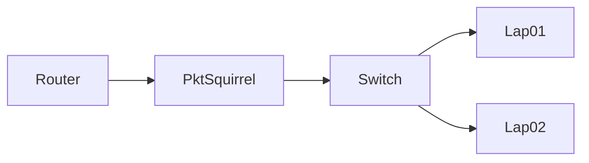

# Packet Squirrel

The [Packet Squirrel by Hak5](https://hak5.org/products/packet-squirrel) is a simple hardware implant that can be used to run a handful of different payloads in a man-in-the-middle (MITM) style deployment. It is designed to be small and to hide in many deployment locations.

While it can do quite a bit, in our scenario, we simply configured it for the first/default payload: packet capture. When deployed, it simply creates a pcap of all data going through it and this data is written to a connected USB stick. 

## Deployment
As deployed in our testbed, it is connected in between the link from the switch to the router, effectively letting it see all inbound/outbound traffic. It *cannot* see traffic only between hosts on the network (not connected to a span port).

<figure>
  
  <figcaption>Deployed Packet Squirrel</figcaption>
</figure>

!!! Warning
    One negative when deploying this is that it has a max interface speed of 100 Mbps. On an IT network, this is likely obvious - the switch light goes orange on our test bed router. However, in an OT network, most of the devices only run at 10/100, and therefore it is likely _not_ an issue.
